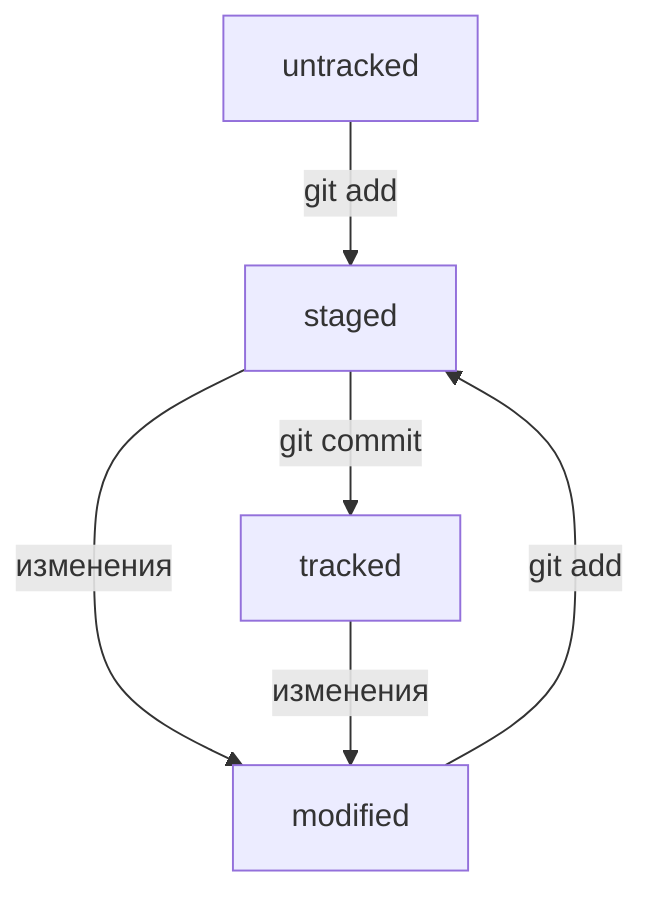

# Это тестовый проект с использованием Git и GitHub

## Это заголовок второго уровня

Символы `_` и `*` позволяют выделить текст курсивом и жирным шрифтом соответственно:

_Курсив_ _Жирный шрифт_

## Выделение кода

Код выделяется тройными кавычками `````

```JavaScript
let message = 'Hello'
let messageArray = message.split('')
let quantity = {};

messageArray.forEach(s => quantity[s] = quantity[s] + 1 || 1);
console.log(quantity)
```

## Хеш

- Хеш - уникальный идентификатор коммита
- Хеш позволяет узнать автора, дату и содержимое закомиченных файлов
- Хеши хранятся в папке .git

## HEAD

HEAD - это служебный файл, который указывает на самый свежий коммит

## Статусы файлов



## Исправление коммита

- git commit --amend -m "Обновлённое сообщение коммита"
- git commit --amend --no-edit
